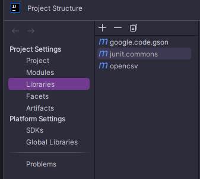

# Hi 👋 I'm Anbu  

🚀 Java Backend Developer | Spring Boot | DSA  

## 👨‍💻 About Me
- 💡 Passionate about Java & Backend Systems
- 🧠 Learning DSA & System Design
- 🔭 Working on Spring Boot projects
- 💬 Ask me about Java, Spring , Spring-boot , Git , Github , SQL

## 🛠️ Tech Stack
- Java | Java 8 | Spring | Spring Boot | Hibernate
- MySQL | IBM DB2 
- Git | Github | BitBucket | Jira | ADO
- REST APIs | Jenkins | WinSCP | Putty | Docker 

## 📫 Connect with Me
- LinkedIn: [linkedin.com/in/anbarasu-a-623a05249](https://www.linkedin.com/in/anbarasu-a-623a05249/)

//  Need to add the dependencies to run this application for Day 27 28 29

//    <groupId>com.opencsv</groupId>
//    <artifactId>opencsv</artifactId>
//    <version>5.9</version>

//    <groupId>com.google.code.gson</groupId>
//    <artifactId>gson</artifactId>
//    <version>2.10.1</version>

//   (junit.commons) // junit // 5.0.0

// Add this dependency in the settings -> project structures -> Libraries
